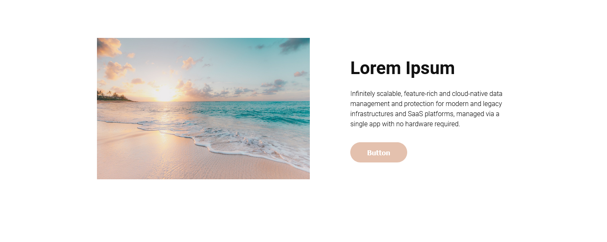
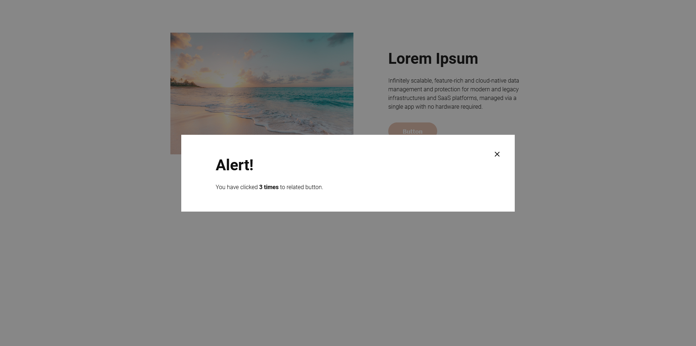
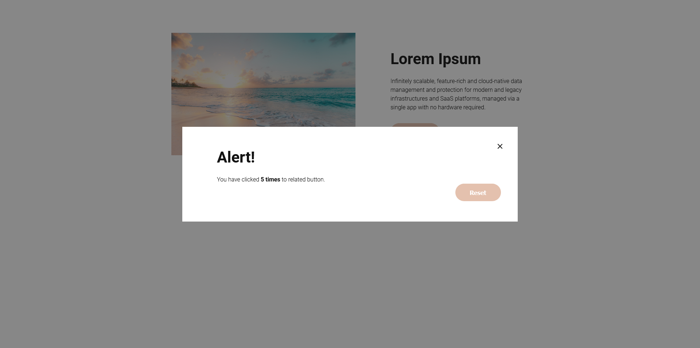

# Zadanie rekrutacyjne GravityGlobal na Frontend Developera

##Zadanie wykonane przez kandydata - Patryk Besler

### Informacje

Moduł został wykonany wedle wymaganego [designu](https://www.figma.com/file/dqY9uYrUYPyr5yjeECoy6X/Recruitment-Task) z użyciem wcześniej wyeksportowanych zdjęć. Kod napisany został, tak aby spełniał wszelkie możliwe aspekty WCAG. Moduł jest responsywny, utrzymany w kontenerze o szerokości 1440px.

### Screenshot

### Zadania

1. Zmienić tytuł strony ✅
2. Stworzyć moduł/sekcję strony ✅
3. Dodać funkcjonalność po kliknięciu buttona ✅

### Kod napisany z użyciem:

-   semantycznego HTML'a
-   czystego CSS i JS
-   zmiennych CSS
-   flexbox (layout)
-   podejścia "mobile-first"
